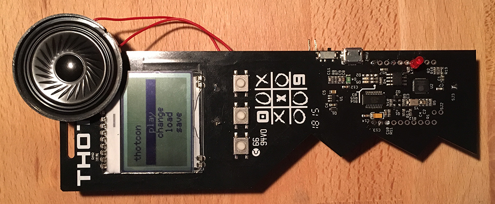

# Morse Code Repeater 
## Thotcon 0x9 Badge Hack

### Requirements

Programmed in [Arduino IDE](https://www.arduino.cc/en/Main/Software) 1.8.3

Follow [SparkFun ESP8266 Thing Dev](https://learn.sparkfun.com/tutorials/esp8266-thing-development-board-hookup-guide/setting-up-arduino) tutorial for Arduino compatibility

[u8g2 Library](https://github.com/olikraus/u8g2) for the display

### About

The morse code repeater started as a badge hack during [Thotcon 0x9](https://thotcon.org/), and was further developed to serve as an example on how to reprogram and use multiple components from the Thotcon 0x9 badge, including the screen, EEPROM, and buttons.

The program allows a user to create, load, and save short strings that can be played back in morse code audibly and visually through a simple menu interface in combination with the buttons.

[demo video](https://www.youtube.com/watch?v=NS1loQiafIQ)

### Hardware connections

GPIO 13 (7th via from the top on right): Connect to the positive side of LED (negative LED side to GND)

GPIO 12 (8th via from the top on right): Connect to the input [Adafruit MAX98306 Amplifier](https://www.adafruit.com/product/987) (differential side to GND)

The top two pins can be used for GND and 3V3 on either header

### Programming

Once the above requirements have been installed, connect the Thotcon badge to the commuter via USB. Open tc_morse.ino in the Arduino IDE. Under `Tools > Board` select `Sparkfun ESP8266 Thing Dev`. Make sure the `Port` is set to the serial port that the badge is connected to. Click the array in the upper left corner of the window to program!

### Other features to implement

I likely will not get around to implementing these, but if you're looking for a way to build upon this project, consider the following:

* The amplifier draws too much power when the screen is on, so connect one of the broken out GPIOs to the shutdown pin on the amplifier. Use the shutdown pin to enable the amplifier/speaker only in play mode.
* Implement a scrolling feature in the menu. I currently limit the number of strings that can be saved/loaded to 3 in order to not have to scroll the text vertically.
* Add support for wireless communication. Possibly create a wireless point that broadcasts the morse code string as the SSID, or transmit the code to anyone connected.
